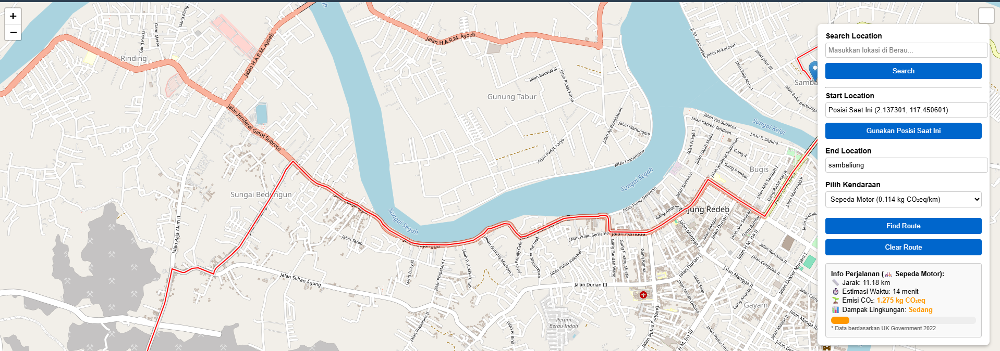
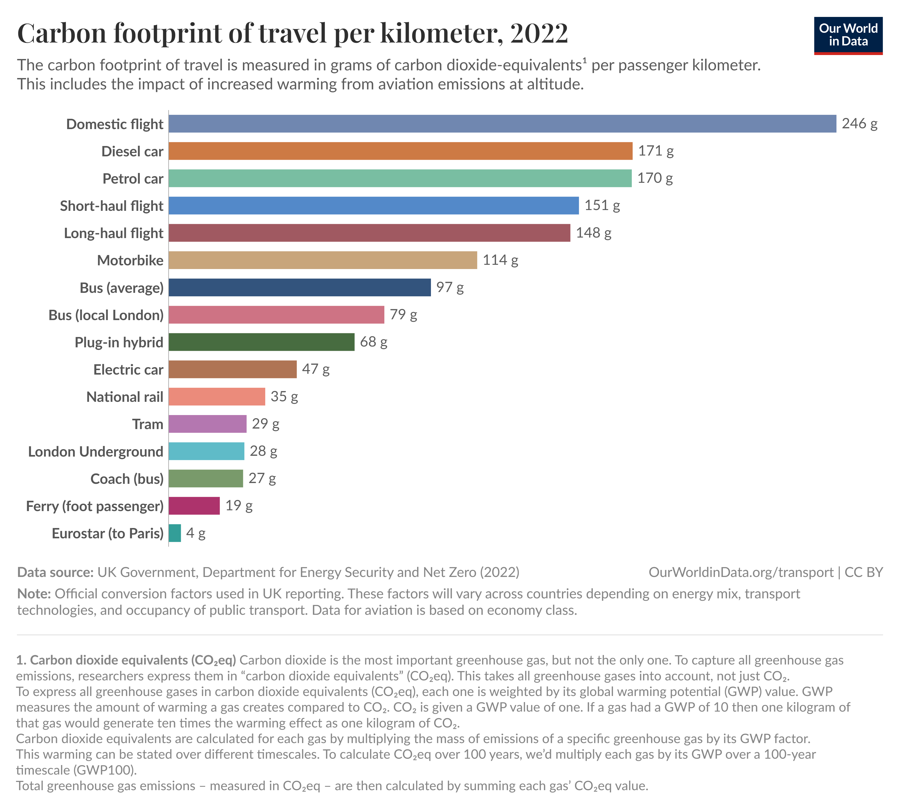

# 🌍 Berau GIS Route: Geospatial Information System for Route Planning with Carbon Footprint Analysis in Berau Regency  

## 📌 Overview  
This project is a **web-based GIS application** that helps users plan travel routes in **Berau Regency, East Kalimantan, Indonesia**.  
It provides multi-point route planning, travel time estimation, and a carbon footprint calculator to support **sustainable mobility**.  

---

## ✨ Features  
- 🚗 **Multi-point Route Planning** – Add and reorder multiple destinations.  
- ⏱ **Travel Time & Distance Estimation** – Based on OpenStreetMap road network.  
- 🌱 **Carbon Footprint Calculator** – Estimates CO₂ emissions from fuel consumption.  
- 🔎 **Location Search with Auto-suggestions** – Powered by Nominatim.  
- 📍 **Customizable Start Location** – Choose GPS current position or manual input.  

---

## 🛠 Technology Stack  
- [Leaflet.js](https://leafletjs.com/) – Interactive web maps  
- [Leaflet Routing Machine](https://www.liedman.net/leaflet-routing-machine/) – Route calculation  
- [OpenStreetMap](https://www.openstreetmap.org/) – Base map & geocoding  
- HTML, CSS, JavaScript  

---

## 🖼 Example Output  

Here is a preview of the system in action:  

  

  

  

  

---

## 🚀 Deployment  
You can host this project for **free** using GitHub Pages:  

1. Fork or clone this repository.  
2. Push your project to GitHub.  
3. Go to **Repository Settings → Pages**.  
4. Choose branch `main` (or `gh-pages`) and save.  
5. Your application will be available at:  
